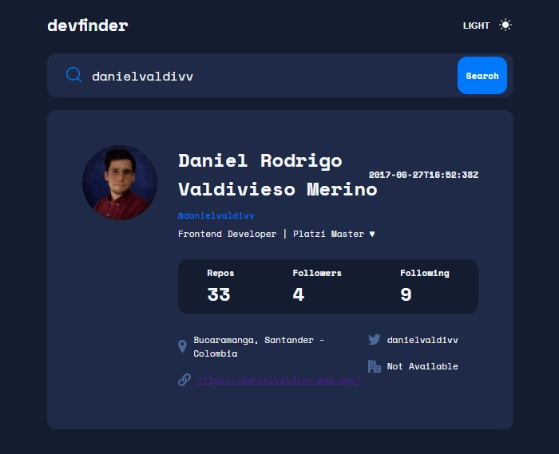
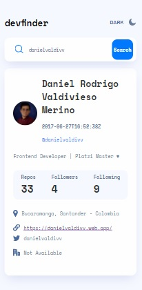

# Rondoo - GitHub user search app solution

## Table of contents

- [Overview](#overview)
  - [The challenge](#the-challenge)
  - [Screenshot](#screenshot)
  - [Links](#links)
- [My process](#my-process)
  - [Built with](#built-with)
  - [What I learned](#what-i-learned)
  - [Continued development](#continued-development)
  - [Useful resources](#useful-resources)
- [Author](#author)
- [Acknowledgments](#acknowledgments)

## Overview

### The challenge

Users should be able to:

- View the optimal layout for the app depending on their device's screen size
- See hover states for all interactive elements on the page
- Search for GitHub users by their username
- See relevant user information based on their search
- Switch between light and dark themes

### Screenshot

Desktop - Dark Mode app
------

Desktop - Light Mode app
------

### Links

- Solution URL: [Add solution URL here](https://github.com/danielvaldivv/GitHub-Searcher)
- Live Site URL: [Add live site URL here](usersgithubsearcher.netlify.app)

### Built with

- Semantic HTML5 markup
- SCSS custom properties
- Flexbox
- CSS Grid
- Desktop-first workflow
- [React](https://reactjs.org/) - JS library
- [Webpack](https://webpack.js.org/) - JS module bundler
- [Prettier](https://prettier.io) -  Code formatter
- [EsLint](https://eslint.org/) -  Static code analysis tool
- [Babel](https://webpack.js.org/) - JS module bundler

## Author

- Website - [Daniel Rodrigo Valdivieso](https://danielvaldivv.web.app/)
- Username- [@danielvaldivv]
- Twitter - [@danielvaldivv](https://www.twitter.com/@danielvaldivv)
